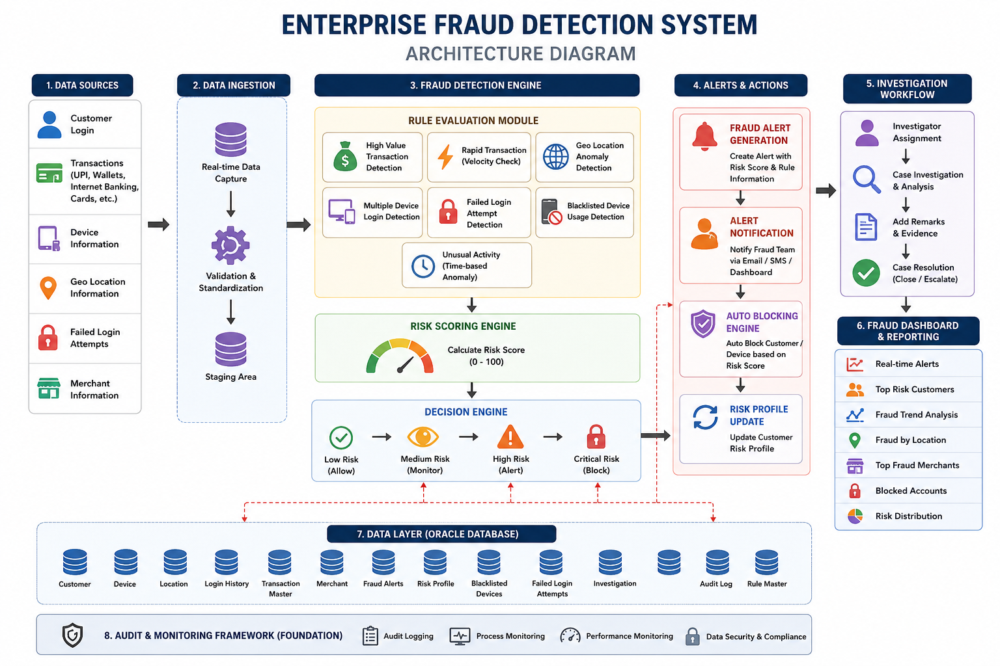
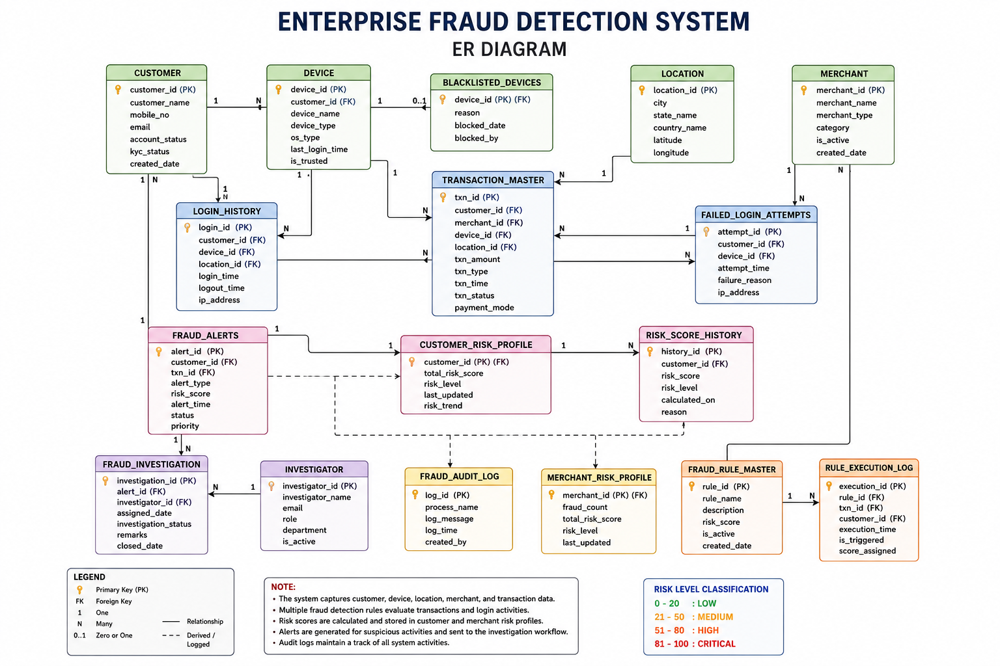

# Enterprise Fraud Detection & Risk Management System

## Overview

Enterprise-grade Fraud Detection System built using Oracle SQL and PL/SQL to detect suspicious banking and digital payment activities.

The system analyzes customer transactions, login activities, device usage, location behavior, and merchant activity to generate fraud alerts and calculate risk scores.

---

## Features

✔ High Value Transaction Detection

✔ Rapid Transaction Detection

✔ Velocity Checks

✔ Geo Location Anomaly Detection

✔ Multiple Device Login Detection

✔ Failed Login Detection

✔ Blacklisted Device Detection

✔ Risk Scoring Engine

✔ Fraud Alert Generation

✔ Customer Auto Blocking

✔ Investigation Workflow

✔ Fraud Dashboard

---

## Technology Stack

- Oracle SQL
- PL/SQL
- DBMS Scheduler
- Triggers
- Stored Procedures

---

## Project Architecture

---

## ER Diagram

---

## Fraud Rules

| Rule | Risk Score |
|--------|-----------|
| High Value Transaction | 30 |
| Rapid Transactions | 25 |
| Geo Anomaly | 20 |
| Multiple Devices | 15 |
| Failed Login | 15 |
| Blacklisted Device | 50 |

---

## Risk Levels

| Score | Level |
|---------|--------|
| 0-20 | Low |
| 21-50 | Medium |
| 51-80 | High |
| >80 | Critical |

---

## Dashboard Queries

- Top Risk Customers
- Fraud Trends
- Fraud By City
- Critical Accounts
- Fraud Alerts

---

## Author

Madhusudan

Aspiring Data Engineer | SQL Developer
